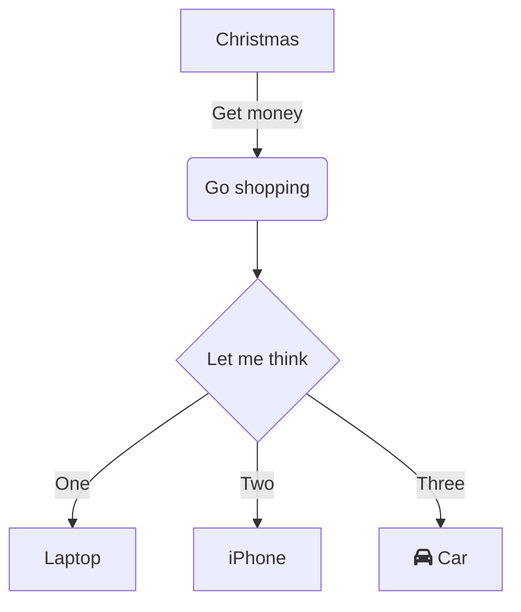

>Markdown 是一种轻量级标记语言，创始人为约翰·格鲁伯。它允许人们使用易读易写的纯文本格式编写文档，然后转换成有效的 XHTML （或者 HTML ）文档。这种语言吸收了很多在电子邮件中已有的纯文本标记的特性。本文详细介绍了 Markdown 的主要语法规则。

<!-- more -->
——来自维基百科

　　Markdown 方便记忆、容易书写，用户可以使用这些标记符号以最小的输入代价生成极富表现力的文档，且语法和各类资源的支持不断完善，因而受到了许多人的欢迎。


## Markdown 简明语法手册

[原始链接](https://www.zybuluo.com/mdeditor?url=https://www.zybuluo.com/static/editor/md-help.markdown>)，有删改，仅供个人测试与备忘之用。


---

### 斜体和粗体

使用 `*` 和 `**` 表示斜体和粗体。

示例：

这是 *斜体*，这是 **粗体**。

### 分级标题

使用 `===` 表示一级标题，使用 `---` 表示二级标题。

示例：

```
这是一个一级标题
============================

这是一个二级标题
--------------------------------------------------

### 这是一个三级标题
```

也可以选择在行首加井号表示不同级别的标题 (H1-H6)，例如：# H1, ## H2, ### H3，#### H4。

### 超链接

使用 `[描述](链接地址 "title文本")` 为文字增加普通外链接。

示例：
>这是去往 [Github](https://github.com) 的链接。

还可以使用 `[文件名](路径)` 添加指向本地文件的链接，示例采用了相对链接，建议使用绝对链接。

示例：
>这里引用了 [icon.png](./images/icon.png) 文件。

### 无序列表

使用 `*`，`+`，`-` 表示无序列表。

示例：

>- 无序列表项 一
>- 无序列表项 二
>- 无序列表项 三

### 有序列表

使用数字和点表示有序列表。

示例：

>1. 有序列表项 一
>2. 有序列表项 二
>3. 有序列表项 三

### 文字引用

使用 `>` 表示文字引用。

示例：

> 野火烧不尽，春风吹又生。

### 行内代码块

使用 \`代码` 表示行内代码块。

示例：

让我们聊聊 `html`。

### 代码块

使用 四个缩进空格 表示代码块，在半角输入状态下，在键盘上用两次 `Tab` 键实现快速缩进。

示例：

    这是一个代码块，此行左侧有四个不可见的空格。

### 插入图像

使用 `` 插入图像。

示例：

```

```


### 字符转义

反斜线 `\` 用于插入在 Markdown 语法中有特殊作用的字符。分别输入：

```
这是用来 *演示* 的 _文本_，

这是用来 \*演示\* 的 \_文本\_。

```

会显示为：

这是用来 *演示* 的 _文本_，

这是用来 \*演示\* 的 \_文本\_。

Markdown 的字符转义功能有限，`\` 只能转义一个或一对字符，可以转义的字符包括：

```
\
`
*
_
{}
[]
()
#
+
-
.
!
```

### 分隔线

在一行中使用三个或更多的 `*`、`-` 或 `_` 来添加分隔线，多个字符之间可以有空格（空白符），但不能有其他字符。

---

## Markdown 进阶语法手册

并非所有站点都支持下列提到的进阶语法，包括本站。

### 内容目录

在段落中填写 `[TOC]` 以显示全文内容的目录结构。

[TOC]

### 标签分类

在编辑区任意行的列首位置输入以下代码给文稿标签：

`标签： 数学 英语 Markdown`

或者

`Tags： 数学 英语 Markdown`

### 删除线

使用 ~~ 表示删除线。

~~这是一段错误的文本。~~

### 注脚

使用 [^keyword] 表示注脚。

这是一个注脚[^footnote]的样例。

这是第二个注脚[^footnote2]的样例。

### 表格

#### 单元格和表头

使用 `|` 来分隔不同的单元格，使用 `-` 来分隔表头和其他行。为了美观，可以使用空格对齐不同行的单元格，并在左右两侧都使用 | 来标记单元格边界：

```
|    name    | age |
| ---------- | --- |
| Emily      |  20 |
| Mike       |  32 |
```

|    name    | age |
| ---------- | --- |
| Emily      |  12 |
| Mike       |  32 |

#### 对齐

在表头下方的分隔线标记中加入 `:`，即可标记下方单元格内容的对齐方式：

`:---` 代表左对齐

`:--:` 代表居中对齐

`---:` 代表右对齐

此外，表格中也可以插入其他 Markdown 中的行内标记。

```
| 项目        | 价格   |  数量  |
| --------   | -----:  | :----:  |
| 计算机     | \$1600 |   5     |
| 手机        |   \$12   |   12   |
| 管线        |    \$1    |  234  |
```

| 项目        | 价格   |  数量  |
| --------   | -----:  | :----:  |
| 计算机     | \$1600 |   5     |
| 手机        |   \$12   |   12   |
| 管线        |    \$1    |  234  |

**可以在 [Tab Convert Online](https://tableconvert.com/) 像 Excel 那样直观地编辑表格，并输出为 Markdown 等其他语言。**

### LaTeX 公式

$ 表示行内公式： 

质能守恒方程可以用一个很简洁的方程式 $E=mc^2$ 来表达，只需输入 `$E=mc^2$` 。

`$$` 表示整行公式[^footnote3]：

```
$$f(x_1,x_x,\ldots,x_n) = x_1^2 + x_2^2 + \cdots + x_n^2 $$

$$\sum^{j-1}_{k=0}{\widehat{\gamma}_{kj} z_k}$$
```

$$f(x_1,x_x,\ldots,x_n) = x_1^2 + x_2^2 + \cdots + x_n^2 $$

$$\sum^{j-1}_{k=0}{\widehat{\gamma}_{kj} z_k}$$

访问 [MathJax](http://meta.math.stackexchange.com/questions/5020/mathjax-basic-tutorial-and-quick-reference) 参考更多使用方法。

### 加强的代码块

Markdown 支持四十一种编程语言的语法高亮的显示，行号显示。在 ``` 之后加入编程语言名称即可实现语法高亮。

但包括本站在内的部分网站只支持高亮一些常见的编程语言。

非代码示例：

```
$ sudo apt-get install vim-gnome
```

Python 示例：

```python
@requires_authorization
def somefunc(param1='', param2=0):
    '''A docstring'''
    if param1 > param2: # interesting
        print 'Greater'
    return (param2 - param1 + 1) or None

class SomeClass:
    pass

>>> message = '''interpreter
... prompt'''
```

JavaScript 示例：

``` javascript
/**
* nth element in the fibonacci series.
* @param n >= 0
* @return the nth element, >= 0.
*/
function fib(n) {
  var a = 1, b = 1;
  var tmp;
  while (--n >= 0) {
    tmp = a;
    a += b;
    b = tmp;
  }
  return a;
}

document.write(fib(10));
```

### 流程图

待补充。可前往参考链接。

#### 示例

```flow
st=>start: Start:>https://emilybear.github.io/
io=>inputoutput: verification
op=>operation: Your Operation
cond=>condition: Yes or No?
sub=>subroutine: Your Subroutine
e=>end

st->io->op->cond
cond(yes)->e
cond(no)->sub->io
```

**更多语法参考：[流程图语法参考](https://www.jianshu.com/p/a0dabf0b6815/)**

### 序列图

#### 示例 1

```seq
Alice->Bob: Hello Bob, how are you?
Note right of Bob: Bob thinks
Bob-->Alice: I am good thanks!
```

#### 示例 2

```seq
Title: Here is a title
A->B: Normal line
B-->C: Dashed line
C->>D: Open arrow
D-->>A: Dashed open arrow
```

**更多语法参考：[序列图语法参考](http://bramp.github.io/js-sequence-diagrams/)**

### 甘特图

[^footnote4]

甘特图内在思想简单。基本是一条线条图，横轴表示时间，纵轴表示活动（项目），线条表示在整个期间上计划和实际的活动完成情况。它直观地表明任务计划在什么时候进行，及实际进展与计划要求的对比。

```gantt
    title 项目开发流程
    section 项目确定
        需求分析       :a1, 2016-06-22, 3d
        可行性报告     :after a1, 5d
        概念验证       : 5d
    section 项目实施
        概要设计      :2016-07-05  , 5d
        详细设计      :2016-07-08, 10d
        编码          :2016-07-15, 10d
        测试          :2016-07-22, 5d
    section 发布验收
        发布: 2d
        验收: 3d
```

**更多语法参考：[甘特图语法参考](https://mermaid-js.github.io/mermaid/#/gantt)**

### Mermaid 流程图 



**更多语法参考：[Mermaid 流程图语法参考](https://mermaid-js.github.io/mermaid/#/flowchart)**

### Mermaid 序列图

```sequence
    Alice->John: Hello John, how are you?
    loop every minute
        John-->Alice: Great!
    end
```

**更多语法参考：[Mermaid 序列图语法参考](https://mermaid-js.github.io/mermaid/#/sequenceDiagram)**

### 定义型列表

名词 1

输入：
```
:   定义 1（左侧有一个可见的冒号和四个不可见的空格）
```

:   定义 1（左侧有一个可见的冒号和四个不可见的空格）

代码块 2

输入：

```
:   这是代码块的定义（左侧有一个可见的冒号和四个不可见的空格）

        代码块（左侧有八个不可见的空格）
```

:   这是代码块的定义（左侧有一个可见的冒号和四个不可见的空格）

        代码块（左侧有八个不可见的空格）

### Html 标签

部分网站支持在 Markdown 语法中嵌套 Html 标签。譬如，你可以用 Html 写一个纵跨两行的表格：

    <table>
        <tr>
            <th rowspan="2">值班人员</th>
            <th>星期一</th>
            <th>星期二</th>
            <th>星期三</th>
        </tr>
        <tr>
            <td>李强</td>
            <td>张明</td>
            <td>王平</td>
        </tr>
    </table>


<table>
    <tr>
        <th rowspan="2">值班人员</th>
        <th>星期一</th>
        <th>星期二</th>
        <th>星期三</th>
    </tr>
    <tr>
        <td>李强</td>
        <td>张明</td>
        <td>王平</td>
    </tr>
</table>

### 内嵌图标

一些网站支持对外开放 [font-awesome](http://fortawesome.github.io/Font-Awesome/3.2.1/icons/) 的图标，可参考对应网站的说明文档。

### 待办事宜 Todo 列表

使用带有 [ ] 或 [x] （未完成或已完成）项的列表语法撰写一个待办事宜列表，并且支持子列表嵌套以及混用Markdown语法，例如：

    - [ ] **Markdown开发**
        - [ ] 改进 Markdown 渲染算法，使用局部渲染技术提高渲染效率
        - [ ] 支持以 PDF 格式导出文稿
        - [x] 新增Todo列表功能 [语法参考](https://github.com/blog/1375-task-lists-in-gfm-issues-pulls-comments)
        - [x] 改进 LaTex 功能
            - [x] 修复 LaTex 公式渲染问题
            - [x] 新增 LaTex 公式编号功能 [语法参考](http://docs.mathjax.org/en/latest/tex.html#tex-eq-numbers)
    - [ ] **七月旅行准备**
        - [ ] 准备邮轮上需要携带的物品
        - [ ] 浏览日本免税店的物品
        - [x] 购买蓝宝石公主号七月一日的船票

对应显示如下待办事宜 Todo 列表：
        
- [ ] **Markdown 开发**
    - [ ] 改进 Markdown 渲染算法，使用局部渲染技术提高渲染效率
    - [ ] 支持以 PDF 格式导出文稿
    - [x] 新增Todo列表功能 [语法参考](https://github.com/blog/1375-task-lists-in-gfm-issues-pulls-comments)
    - [x] 改进 LaTex 功能
        - [x] 修复 LaTex 公式渲染问题
        - [x] 新增 LaTex 公式编号功能 [语法参考](http://docs.mathjax.org/en/latest/tex.html#tex-eq-numbers)
- [ ] **七月旅行准备**
    - [ ] 准备邮轮上需要携带的物品
    - [ ] 浏览日本免税店的物品
    - [x] 购买蓝宝石公主号七月一日的船票
## 注脚

[^footnote]: 这是一个 *注脚* 的 **文本**。

[^footnote2]: 这是另一个 *注脚* 的 **文本**。

[^footnote3]: 受框架限制，站点的 Markdown 只支持部分简单的公式的渲染。

[^footnote4]: 由于种种原因，本站不支持 Mermaid 。